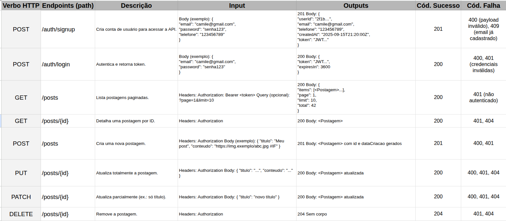

EXERCICIO 1:




# IFgram API (com Spring Security, JPA e H2)

Este projeto é um exemplo simples de API feita com **Spring Boot**.  
Tem autenticação com **Spring Security** (token Bearer HMAC), banco **H2 em memória** e CRUD de **posts**.

## O que tem
- `POST /auth/signup` → cria usuário e já retorna token
- `POST /auth/login` → faz login e retorna token
- `GET /health` → só pra ver se a API está no ar (público)
- `GET /posts` → lista posts (precisa de token)
- `GET /posts/{id}` → pega 1 post (precisa de token)
- `POST /posts` → cria post (precisa de token)
- `PUT /posts/{id}` → atualiza tudo (precisa de token)
- `PATCH /posts/{id}` → atualiza parte (precisa de token)
- `DELETE /posts/{id}` → remove (precisa de token)

## Requisitos
- **Java 17** ou mais
- **Maven**

## Como rodar
Dentro da pasta do projeto, execute:
```
mvn clean package -DskipTests
java -jar target/ifgram-complete-api-0.0.1-SNAPSHOT.jar
```
ou, se preferir:
```
mvn spring-boot:run
```

A API sobe em `http://localhost:8080`  
Teste rápido:
```
GET http://localhost:8080/health
```
Deve retornar `{"status":"UP"}`.

## Como usar (exemplos)
### 1) Criar usuário (signup)
```
POST http://localhost:8080/auth/signup
Content-Type: application/json

{
  "email": "camile@gmail.com",
  "password": "senha123",
  "telefone": "123456789"
}
```
→ Resposta `201` com `token` e dados do usuário.

### 2) Fazer login
```
POST http://localhost:8080/auth/login
Content-Type: application/json

{
  "email": "camile@gmail.com",
  "password": "senha123"
}
```
→ Resposta `200` com `{ "token": "...", "expiresIn": 3600 }`.

### 3) Listar posts (com token)
Coloque o header:
```
Authorization: Bearer SEU_TOKEN_AQUI
```
Chame:
```
GET http://localhost:8080/posts
```

### 4) Criar post
```
POST http://localhost:8080/posts
Authorization: Bearer SEU_TOKEN_AQUI
Content-Type: application/json

{
  "titulo": "Meu primeiro post",
  "conteudo": "Hello IFgram!"
}
```

## Banco de dados
- Usa **H2 em memória** (não precisa instalar nada).
- Console do H2: `http://localhost:8080/h2-console`
  - JDBC URL: `jdbc:h2:mem:ifgramdb`
  - User: `sa` / senha em branco

## Estrutura do código
- `entity/` → classes do banco (`User`, `Post`)
- `repository/` → `JpaRepository` para `User` e `Post`
- `service/` → regras simples de negócio (`UserService`, `PostService`)
- `controller/` → rotas HTTP (`AuthController`, `PostController`, `HealthController`)
- `security/` → `TokenService` (HMAC) e filtro `BearerTokenFilter`
- `config/` → `SecurityConfig` (stateless + liberação do /auth e /health)

## Dicas
- Se der erro de versão, veja se seu Java é **17+** (`java -version`).
- Se der `403` no `/auth/signup`, confira se o método é `POST` e se o **Content-Type** é `application/json`.
- Se der `401` nas rotas de `/posts`, verifique se o **Authorization** está correto: `Bearer SEU_TOKEN_AQUI`.

## Importante
Este token HMAC é didático. Em produção, use **JWT** de verdade e um segredo em variável de ambiente.
